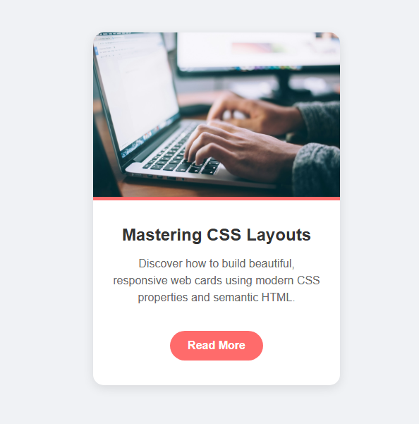

# Blog Post Card Component

A responsive, styled blog post card built as part of the freeCodeCamp curriculum. This project demonstrates mastery of CSS borders, backgrounds, spacing, and hover effects.



##  Live Demo
[View the Live Project](https://simiyuu.github.io/blog-post-card-lab/)

##  Project Objective
The goal was to build a card component that matches a specific set of user stories and visual design requirements, focusing on:
- Semantic HTML structure.
- CSS Box Model (Padding, Margin, Borders).
- `border-radius` for rounded aesthetics.
- Interactive hover states.

##  Technologies Used
- **HTML5**: For structure and semantic elements.
- **CSS3**: For styling, layout, and visual effects.

##  How to Run Locally
1. Clone the repository:
   ```bash
   git clone [https://github.com/YOUR_USERNAME/blog-post-card-lab.git](https://github.com/Simiyuu/blog-post-card-lab.git)